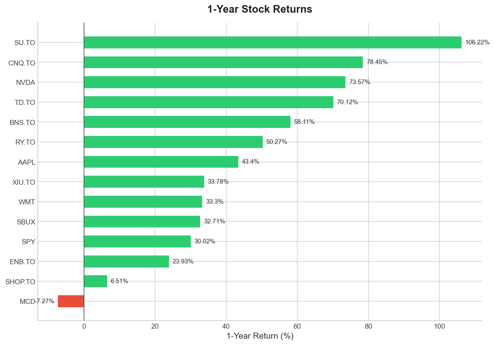
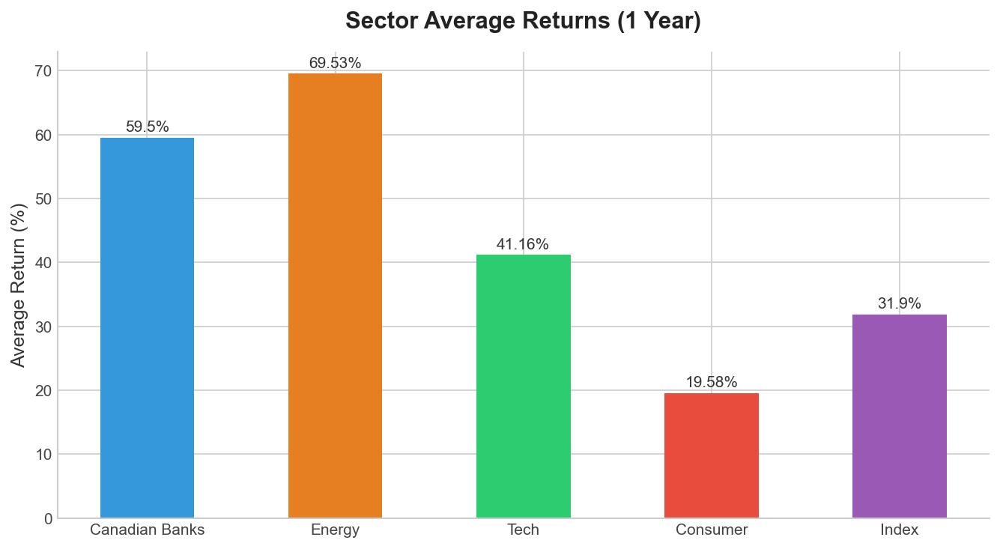
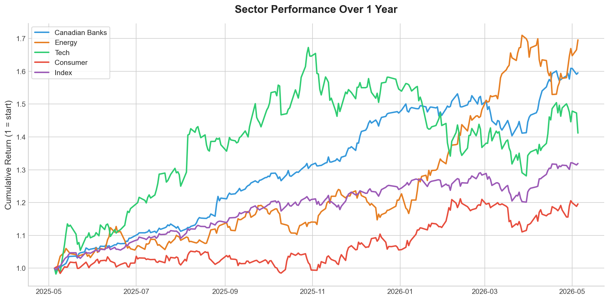

# Canadian Stock Sector Analyzer

A Python data analysis project that pulls 1 year of real stock market data for 14 TSX and NYSE stocks across 5 sectors, calculating returns, volatility, and sector performance.

## Findings

- Energy was the top performing sector with an average return of 69.5%, led by Suncor (SU.TO) at +106%
- Canadian Banks came in second at 59.5%, significantly outperforming the S&P 500 index at +30%
- Shopify was the most volatile stock but only returned 6.5%, high risk low reward this year
- McDonald's was the only stock with a negative return at -7.3%

## Sectors Analyzed

| Sector | Tickers |
|---|---|
| Canadian Banks | RY.TO, TD.TO, BNS.TO |
| Energy | SU.TO, CNQ.TO, ENB.TO |
| Tech | SHOP.TO, NVDA, AAPL |
| Consumer | MCD, SBUX, WMT |
| Index | SPY, XIU.TO |

## Charts

## Tech Stack

- Python
- pandas
- yfinance
- matplotlib
- Git

## How to Run

1. Clone the repo
2. Install dependencies:

pip install pandas yfinance matplotlib

3. Collect data and run analysis:

python analysis.py

4. Generate charts:

python charts.py